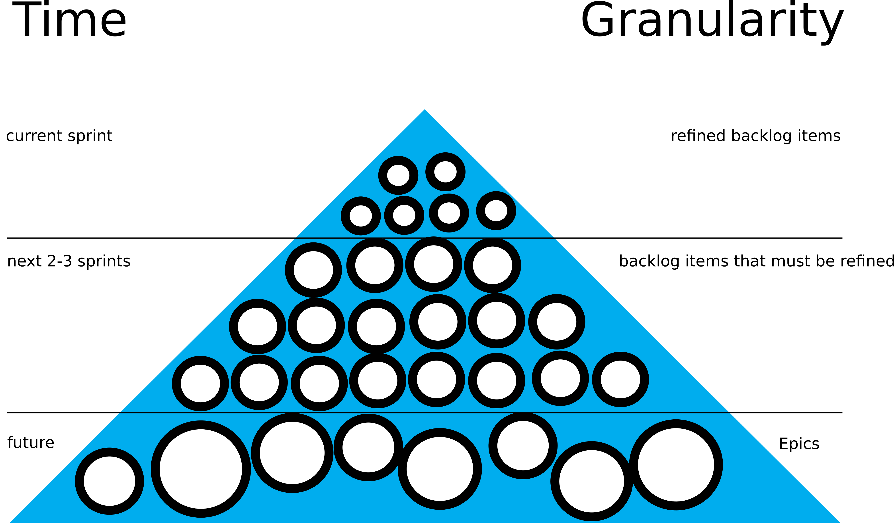

# Guidelines

This project is organized by using elements of [scrum](https://en.wikipedia.org/wiki/Scrum_(software_development)).

It is based on the five values:

* Commitment

* Focus

* Openness

* Respect

* Courage

and has three conditions:

* Transparency (Information must be available to everyone)

* Inspection (Decide in specific time intervals if the current working method is effective.)

* Adaption (If the teams detects methods that can be improved it must do that!)

## Definition of Done

We say a task (sprint item) is done if 

* It is reviewed by one of the team members.

* It is documented either in the technical or the user documentation.

* The final result is available on the staging instance.

## Task Management

There are three different types of tasks which are depicted in the following figure:

* The main vision is represented in Epics. Epics are not definied in detail and can change in future. 
  Those can be found in the Github Repository. They are created by the product owner.

* Backlog items that must be refined are defined as GitHub projects. Those items must be discussed with the developer teams in order to prepare tasks for the next sprint.

* Sprint items are tasks that are defined as small and independent as possible.

### Backlog Item Priority

Backlog Items are prioritized using the MoSCoW method where Tasks are labeled with

* Must have

* Should have

* Could have

* Won't have

### Sprint Item Priority

Sprint Items are priorities by setting the order of sprint items in
the Backlog Item. Here the top item represents the most important one and the 
lowermost the most unimportant issue.

## Meetings

Our Meetings consist of four parts:

* **Sprint Review**
  The developer team should show every new feature in the staging version of the portal. The product owner must check which sprint items are done. (99% percent of the task is not done!). The developer team decides which items should be part of the next sprint or maybe can not be continued. Under certain conditions the product backlog must be adapted. 
  
* **Retrospective**
  In the context of the Retrospective the developer team tries to improve the next sprint based on the experiece of the last one. For example the team could decide to modify the definition of done. Questions should be asked like 
    * How was the collaboration with others?
    * How can we improve our communication?
    * Do we really need all the development tools? Maybe we can remove our even swap out specific tools.
    * How can we build faster and better our product?

* **Sprint planning 1:**
  This part answers the question which product increment should be created in the next sprint.
  It is based on the current product backlog, the current development status and the velocity 
  and net work time of the team. The product owner presents product backlog for the next sprint.
  Just the development team is able to decide which items can be done during the next sprint.
  At the end the development team must define a common goal for the next sprint.

* **Sprint planning 2:**
  This part answers how we should approach the tasks. The product owner presents the backlog items which are sorted by
  priority. The team develops based on those backlog items tasks which represent the sprint backlog. Those tasks should not   take more time then one working day. The tasks are valued by using story points for estimating the work of the next sprint.
  How to evaluted tasks by using story points is described [here](story_points.md).
  
  
## Bug Commissioner
For each sprint there is a bug commissioner.

The tasks of the bug commissioner are as follows:

* **Second Reviewer**
  The bug commissioner is always the second reviewer. He/She makes sure that all points of the Issue Template are fulfilled.
  This includes adjusting the existing e2e tests if necessary.
  
* **Staging**
  He/She is responsible for ensuring that the staging instance is up-to-date and online at the sprint meeting.
  Therefore he/she sets a deadline for the other team members up to which changes will still be included.
  
* **Releasing**
  He/She updates the various changelogs and creates the new releases.
  
* **Bugs**
  He/She creates the upcoming bug issues in github and is initially responsible for them, but can also forward the issues if needed.
  
* **Dependabot PRs**
  The commissioner reviews pull requests created by dependabot.

## Feature Commissioner
For each sprint there is a feature commissioner.
The role of the feature commissioner is usually taken over by the person who was the bug comissioner in the previous sprint.

The Commissioner has the following responsibilities:

* **Listing new features**
  The commissioner reviews the features of the new releases that have been released in his sprint.
He lists the new features and user-relevant changes and saves them together with a short description in the CHANGELOG of the respective repository.

* **Writing a post**
  If a new post is to be created in the course of the sprint, the commissioner summarizes the points in the respective changelogs into a short text so that it can be published. The publication is tracked via WordPress. In the course of this the changelogs are emptied again, so that the commissioner of the following sprint can start with an empty list. 

## Development Workflow

See the following development workflow:

[Development Workflow](development-workflow.md)
